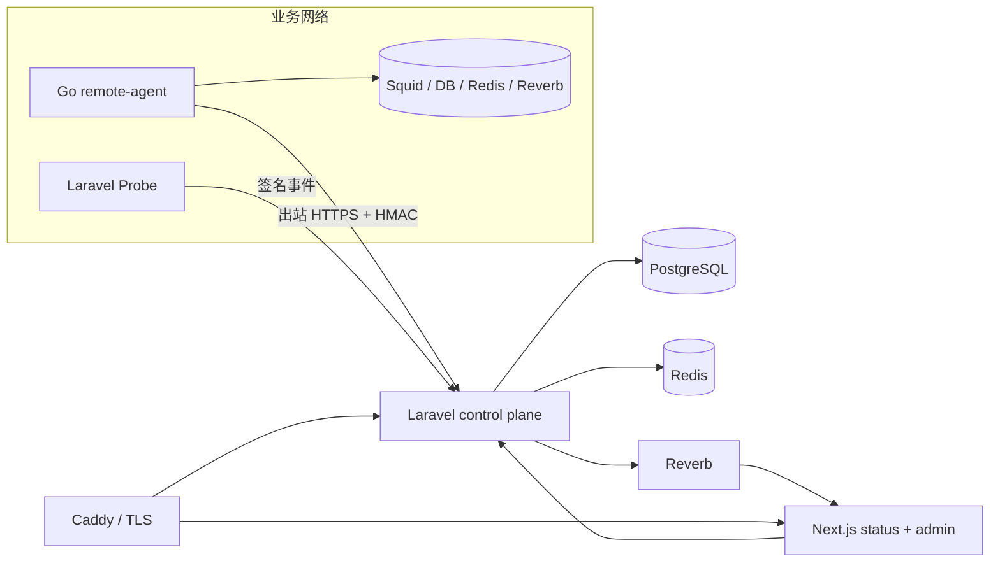

# Server Status Page

自托管的单组织状态监控服务。它包含公开状态页、私有管理后台、Laravel 控制面、出站式 Go Agent，以及供业务应用安装的 Laravel 探针包。

公开页面不会生成或猜测状态；页面只展示 PostgreSQL 中由真实 Agent、Queue canary、Scheduler heartbeat 或签名 Push 写入的结果。`DemoSeeder` 仅在显式设置 `STATUS_SEED_DEMO=true` 时启用。

## 架构



- PostgreSQL 保存配置、原始结果、状态区间、事件、维护、通知 outbox 和聚合数据。
- Redis 承担 Reverb 实时广播和可丢失缓存；核心调度锁使用 PostgreSQL database cache，状态评估与通知意图不依赖 Redis。
- Agent 每 15 秒用 ETag 同步版本化计划，在本地以 ±10% jitter 调度，并将断网结果保存在有界 SQLite WAL 中。
- 管理后台实时订阅 `public-status`，同时每 30 秒轮询降级。

## 快速启动

要求：Docker Engine 与 Compose v2。控制面应部署在与被监控业务不同的主机或故障域。

首次部署到公网 VPS，请直接阅读 [生产部署手册](docs/DEPLOYMENT.md)。手册包含 DNS、Docker、防火墙、生产 `.env`、SMTP、HTTPS、Agent、验收、备份、升级和故障排查。如果宿主机已有 Nginx 或 Caddy，请按手册中的反向代理边界调整监听端口；不要把真实主机清单、证书路径或运维凭据提交到仓库。

```bash
make init
make up
make owner OWNER_EMAIL=owner@example.com
```

`make init` 只在 `.env` 不存在时生成随机 APP_KEY、PostgreSQL、Redis 与 Reverb 密钥。`make owner` 会交互式要求至少 12 位密码，并输出一个有效期 60 分钟的一次性 Agent enrollment token。

将该 token 写入 `.env` 的 `STATUS_AGENT_ENROLLMENT_TOKEN`，再启动中心 Agent：

```bash
make agent-up
```

浏览器访问 `http://localhost`。生产部署时至少修改：

```dotenv
STATUS_SITE_ADDRESS=status.example.com
APP_URL=https://status.example.com
SESSION_DOMAIN=status.example.com
SESSION_SECURE_COOKIE=true
SANCTUM_STATEFUL_DOMAINS=status.example.com
CORS_ALLOWED_ORIGINS=https://status.example.com
REVERB_ALLOWED_ORIGINS=status.example.com
NEXT_PUBLIC_REVERB_WS_URL=wss://status.example.com/app/<REVERB_APP_KEY>?protocol=7&client=js&version=8.4.0&flash=false
MAIL_MAILER=smtp
```

Caddy 会为真实域名自动申请 TLS。数据库、Redis、Agent 状态和 Caddy 证书均使用命名卷持久化。

## 添加 Agent

后台“Agent”页面可签发一次性 enrollment token；也可使用：

```bash
docker compose exec api php artisan status:agent-token edge-cn
```

在目标主机运行：

```bash
docker run --read-only --restart unless-stopped \
  -e STATUS_AGENT_SERVER_URL=https://status.example.com \
  -e STATUS_AGENT_ENROLLMENT_TOKEN='<one-time-token>' \
  -e STATUS_AGENT_NAME=edge-cn \
  -v status-agent-data:/var/lib/status-agent \
  server-status-page-agent:local
```

保留 `/var/lib/status-agent`，其中包含权限为 `0600` 的 Agent 凭据、最近计划和离线结果。Agent 只执行编译内置的 typed probes，不接受 Shell 命令。

连接密码推荐留在 Agent 环境变量或 `/run/secrets`：

```json
{
  "host": "db.internal",
  "user": "status_probe",
  "password": { "secretRef": "env://STATUS_DB_PASSWORD" }
}
```

支持的主动类型：HTTP/HTTPS、Next.js、Laravel、TCP、DNS、TLS、Squid、MySQL、PostgreSQL、Redis、Reverb/Pusher。Laravel Queue、Scheduler 与 Push Heartbeat 为被动事件类型。

## Laravel Queue、Scheduler 与 Reverb

业务项目安装本仓库包：

```json
{
  "repositories": [
    { "type": "path", "url": "../server-status-page/packages/laravel-probe" }
  ]
}
```

```bash
composer require status-page/laravel-probe
php artisan vendor:publish --tag=status-probe-config
```

在后台“Laravel 集成”创建应用，系统只显示一次 endpoint 与双密钥轮换所需配置：

```dotenv
STATUS_PROBE_APP_ID=orders-api
STATUS_PROBE_PUSH_URL=https://status.example.com/api/probe/v1/integrations/<integration-id>/events
STATUS_PROBE_SECRET_CURRENT=<shown-once-secret>
```

然后在 `config/status-probe.php` 中列出真实生产 queue connection/queue。包每分钟向每个队列投递 `tries=1` 的无副作用 canary，同时发送 Scheduler tick。控制面按 `application_id + target` 将事件路由到对应 `laravel_queue` / `laravel_scheduler` 监控项：

- Queue canary 150 秒未完成进入降级，210 秒未完成进入中断；连续两个准时完成后恢复。
- Scheduler tick 150 秒未到进入降级，210 秒未到进入中断；关键任务可单独上报成功或失败。
- Reverb 深探先订阅 `status-probe.public`，再调用 HMAC trigger，并要求收到同一随机 nonce。

完整包配置、readiness、密钥轮换和任务包装示例见 `packages/laravel-probe/README.md`。

非 Laravel 的本机 systemd 服务可使用[本机 systemd + UDP/freshness Heartbeat](docs/LOCAL_HEARTBEAT.md)：脚本固定检查 unit active，可选检查 UDP listener 或周期更新文件的新鲜度，再通过 monitor 独立密钥签名上报；secret 只从 root-only `0600` 文件读取。

## 状态、事件与通知

- 普通监控默认 60 秒，可配置 15 秒至 24 小时；连接超时 2 秒、总超时 5 秒、Reverb 10 秒。
- 连续 2 次失败进入性能下降，3 次失败进入中断；连续 2 次成功恢复。慢响应需连续 3 次超过阈值。
- 配置/认证错误会通知管理员但不会公开为业务中断。Agent 离线显示未知，不会把其全部目标标成 Down。
- 确认故障自动创建公开事件；管理员可以覆盖级别、文案和阶段。
- 维护期间继续采样、抑制故障告警，且默认从 uptime 中排除。
- SMTP 用于管理员告警；Webhook 包含 delivery ID，并使用 `X-Status-Signature: sha256=<hmac>` 签名。
- 通知策略支持组件过滤、事件过滤、静默时段和重复提醒间隔；恢复通知不受静默时段阻止。

## 数据保留与运维

- 原始结果默认保留 30 天；`check_results` 使用 PostgreSQL 月分区。
- 状态区间用于按持续时长计算 uptime；每日 rollup 默认保留 13 个月。
- 最近 90 天按状态页时区汇总；当天每 5 分钟更新一次部分 rollup，次日再生成最终值。
- 没有真实监控数据的日期保持灰色“暂无数据”，不计入 uptime，也不会用当前状态伪造历史。
- 事件、维护和审计长期保留。
- 备份至少包含 PostgreSQL 与 `.env`；Agent volume 可丢失，但丢失后需要重新 enrollment。

常用命令：

```bash
make logs
make migrate
make test
docker compose exec api php artisan status:rollup --date=2026-07-10
docker compose exec api php artisan status:ensure-partitions
```

升级时先备份 PostgreSQL，再执行 `docker compose build && docker compose run --rm api-init && docker compose up -d`。

## API 概览

- Public：`GET /api/public/v1/status`、`GET /api/public/v1/history` 和事件详情；首页直接展示并切换历史周期。响应中的 `history_available_from` 表示最早存在真实观测数据的日期，前端据此禁用没有数据的上一周期。每日历史的 `status_periods` 会按状态页时区裁剪异常区间，提供状态、起止时间、持续秒数、是否仍在进行以及分组视图中的组件名称。
- Admin：`/api/admin/v1/*`，使用 Sanctum 同源 session，Owner/Admin/Viewer 服务端鉴权。
- Agent：enroll、ETag plan、heartbeat 与 results batch；每次请求使用 timestamp + nonce + raw-body SHA256 的 HMAC。
- Laravel Probe：使用独立 `STATUS-PROBE-HMAC-SHA256-V1` canonical、current/next secret 和 replay nonce。

任何公开响应、Webhook 或日志都不返回 DSN、数据库错误、Agent secret、内网地址或堆栈。

## 验证

```bash
cd apps/web && npm test && npm run lint && npm run typecheck
cd apps/api && php artisan test
cd agent && go test -race ./... && go vet ./...
cd packages/laravel-probe && composer install && vendor/bin/phpunit
```

Docker 在本机可用时，再运行 `docker compose config` 与完整 Compose 烟测。
